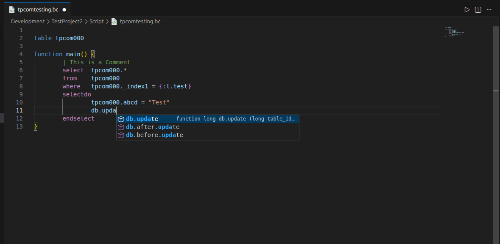
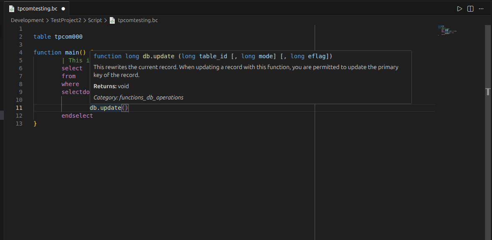
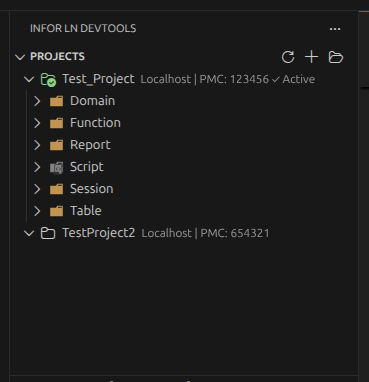
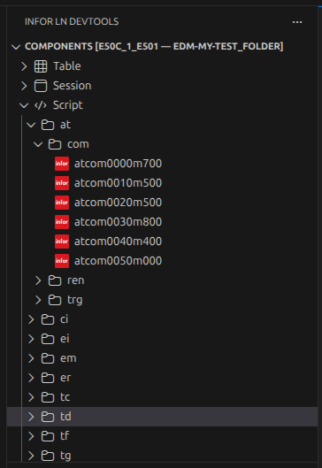
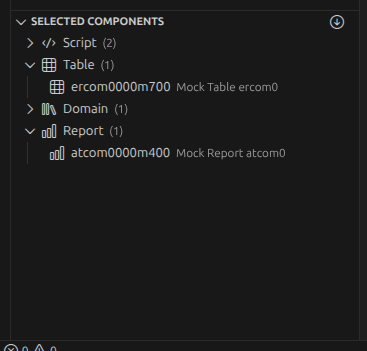
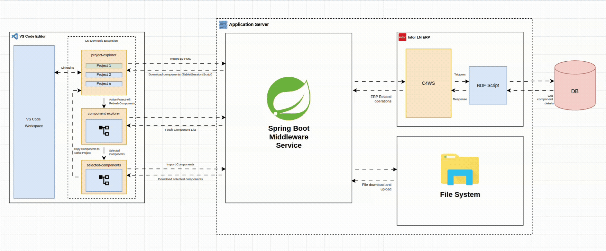

# LN DevTools Extension

[]()


**LN DevTools** is a Visual Studio Code extension that enhances developer workflow for **Infor LN ERP**, allowing developers to browse, select, and import LN components directly into a local development workspace.

---

## 🚀 Key Features

### 📦 Component Exploration

- Hierarchical component view:
  ```
  Type → Package → Module → Component
  ```
- Supported component types:
  - **Table**
  - **Session**
  - **Script**
  - **Function**
  - **Domain**
  - **Report**
- Lazy backend loading:
  - `/vrcs` → List all VRCs
  - `/vrcs/{vrcId}/packages` → Packages in VRC
  - `/vrcs/{vrcId}/packages/{packageId}/modules` → Modules in package
  - `/vrcs/{vrcId}/components` → Component codes

### 🎯 Selection Panel

- Dedicated **Selected Components** panel
- Grouped by type
- Supports:
  - Remove individual
  - Remove all
  - Import Selected

### 🧰 Import Workflow

1. Selected components sent to backend:
   - **Multipart/form-data** (preferred)
   - **Legacy JSON** (still supported)
2. Backend returns a **binary ZIP** (`Content-Type: application/zip`)
3. ZIP is extracted to:
   ```
   <Workspace>/<ProjectFolder>/
   ```
4. Tree selection is cleared

### ⚙ Persistent Settings

Stored in VS Code global state:

- Backend API URL
- Base VRC
- Project Folder

---

## 🧠 BaanC Language Support

**LN DevTools** includes built-in support for the **BaanC programming language**, bringing a modern coding experience to Infor LN development inside VS Code.

### ✨ Features

#### 🎨 Syntax Highlighting

- Rich syntax highlighting for **BaanC source files**
- Covers:
  - Keywords, data types, and control structures
  - Built-in Baan / LN functions
  - Comments, strings, and constants
  - Operators and expressions

---

#### ⚡ Intelligent Autocomplete

- Context-aware autocomplete for:
  - Built-in **BaanC functions**
  - Language keywords and constructs
- Automatically triggered while typing or via <kbd>Ctrl</kbd> + <kbd>Space</kbd>



---

#### 📘 Function IntelliSense

- Inline function signature help
- Displays:
  - Function name
  - Parameter list with order
  - Parameter types (where applicable)
- Reduces the need to reference external documentation



---

## 🖥️ Extension UI Overview

### 🧰 Project Explorer

Displays Project List:



### 📦 Component Explorer

Hierarchical view of LN components:



### 📥 Import Component Flow

Selection List + Import trigger:



---

### 🧩 Supported File Types

- `.bc`

> Language features are automatically activated when opening supported BaanC files.

---

## 🌐 Backend API Contract

The extension communicates with the **Infor LN DevTools API**, which follows the hierarchical structure: **VRC → Package → Module → Component**. All binary endpoints return raw ZIP bytes.

### 1) System & Environment

#### Get System Health

**Endpoint:** `GET /health`
**Response (200 OK):**

```json
{
  "status": "up",
  "backendConnection": "active",
  "version": "10.5"
}
```

#### Get User Context

**Endpoint:** `GET /user-context`
**Response (200 OK):**

```json
{
  "userId": "jdoe",
  "currentVrc": "B61U_a_stnd",
  "developerAuthorization": "active"
}
```

### 2) VRC & Structure Navigation

#### List VRCs

**Endpoint:** `GET /vrcs`
**Response (200 OK):**

```json
[
  { "id": "B61_a", "description": "Standard 6.1 a" },
  { "id": "B61U_a_stnd", "description": "Update 6.1 a Standard" }
]
```

#### List Packages in VRC

**Endpoint:** `GET /vrcs/{vrcId}/packages`
**Response (200 OK):**

```json
[
  { "id": "tc", "description": "Tools Common" },
  { "id": "wh", "description": "Warehousing" }
]
```

#### List Modules in Package

**Endpoint:** `GET /vrcs/{vrcId}/packages/{packageId}/modules`
**Response (200 OK):**

```json
[
  { "id": "sls", "description": "Sales" },
  { "id": "pur", "description": "Purchase" }
]
```

### 3) Component Management

#### List Components

**Endpoint:** `GET /vrcs/{vrcId}/components`
**Query Parameters:** `package`, `module`, `type` (optional)

**Response (200 OK):**

```json
[
  { "name": "tdsls4100m000", "type": "session", "description": "Sales Orders" },
  { "name": "tdsls4100", "type": "table", "description": "Sales Orders Header" }
]
```

#### Create Component

**Endpoint:** `POST /vrcs/{vrcId}/components`
**Body:**

```json
{
  "name": "whinh2100m000",
  "type": "session",
  "package": "wh",
  "module": "inh",
  "description": "Warehouse Orders Custom"
}
```

#### Get Component Metadata

**Endpoint:** `GET /vrcs/{vrcId}/components/{type}/{name}`
**Response (200 OK):**

```json
{
  "name": "tdsls4100m000",
  "type": "session",
  "mainTable": "tdsls400",
  "sessionType": "maintain",
  "description": "Sales Orders"
}
```

#### Delete Component

**Endpoint:** `DELETE /vrcs/{vrcId}/components/{type}/{name}`

### 4) Source Code & Content (Import/Export)

#### Download Source

**Endpoint:** `GET /vrcs/{vrcId}/components/{type}/{name}/source`

#### Upload / Update Source

**Endpoint:** `PUT /vrcs/{vrcId}/components/{type}/{name}/source`
**Body:** Raw text or JSON/XML depending on component type

### 5) Development Actions (Compile & SCM)

#### Compile Component

**Endpoint:** `POST /vrcs/{vrcId}/components/{type}/{name}/compile`
**Response (200 OK):**

```json
{
  "status": "success",
  "warnings": [],
  "errors": []
}
```

#### SCM Operations

- Check Out: `POST /vrcs/{vrcId}/components/{type}/{name}/scm/checkout`
- Check In: `POST /vrcs/{vrcId}/components/{type}/{name}/scm/checkin`
- Undo Check Out: `POST /vrcs/{vrcId}/components/{type}/{name}/scm/undocheckout`

### 6) Import Components

**Endpoint:** `POST /vrcs/{vrcId}/components/import`

- Preferred: `multipart/form-data` with optional file upload
- Legacy JSON still supported

**Multipart fields example:**

- `importFolder`: string
- `components`: JSON string of array `[ { type, package, module, code } ]`
- `projectName`: string
- `pmc`: string (optional)
- `ticketId`: string

**Response:** Raw ZIP bytes containing imported components

### 7) PMC (Product Maintenance & Control)

#### List Solutions

**Endpoint:** `GET /pmc/solutions`
**Query Parameters:** `status=in_progress|released|exported`

#### Get Solution Details

**Endpoint:** `GET /pmc/solutions/{solutionId}`

#### List Components in Solution

**Endpoint:** `GET /pmc/solutions/{solutionId}/components`

#### Export Solution

**Endpoint:** `POST /pmc/solutions/{solutionId}/export`
**Response:** Raw ZIP bytes of exported components

### 8) Extracted Folder Structure

After importing components, expected workspace layout:

```
📁 Workspace/
 └─ 📁 <project-name>/
    ├─ 📁 Domain/
    ├─ 📁 Table/
    ├─ 📁 Session/
    ├─ 📁 Script/
    ├─ 📁 Function/
    └─ 📁 Report/
```

### 9) VS Code Commands

| Command            | Action                                                |
| ------------------ | ----------------------------------------------------- |
| Refresh            | Reload package tree from backend                      |
| Configure Settings | Update Base VRC + Project Folder                      |
| Update Server URL  | Change API endpoint                                   |
| Select Component   | Add/remove from selection                             |
| Import Selected    | Trigger `/import` and add files to Project folder |

## 🏗️ Architecture



- **Frontend (Extension):** Component explorer, selection panel, import/export triggers.
- **Backend (Mock/Real API):** REST API endpoints, ZIP generation, source handling, SCM actions.
- **Workspace:** Stores imported LN components in structured folders (TD/FD/Table/Session/Script).

---

## 📅 Roadmap [DevTools]

- Export support
- Compilation support
- Check-in / Check-out support
- Integration with SCM / versioning workflows

---

### 🚧 Planned Enhancements [Language Support]

- Go-to definition for BaanC functions
- Hover documentation for functions and keywords
- Diagnostics and linting for common BaanC issues
- Code formatting support

## 📜 License

This project is licensed under the MIT License - see the [LICENSE](LICENSE.md) file for details.
