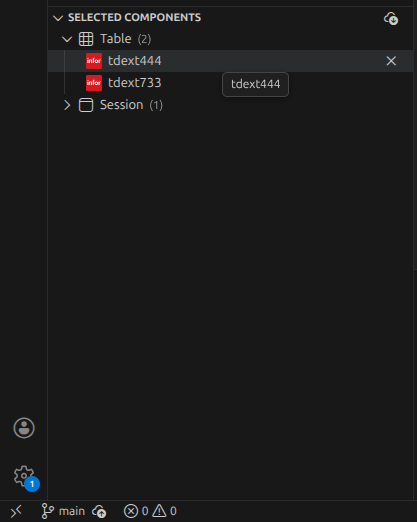

# LN DevTools VS Code Extension

**LN DevTools** is a VS Code extension designed to improve developer workflow when working with LN ERP artifacts such as Tables, Sessions, Scripts, etc.  
It enables browsing, selecting, importing, and unloading LN components directly inside VS Code.

---

## 🚀 Features

- Browse LN Components by:
  - **Table**
  - **Session**
  - **Script**
- Displays component metadata such as:
  - Package
  - Module
  - Code
- Import selected components into LN Development folder
- Automatically extracts imported zip content
- Allows configuring:
  - Package Combination (VRC)
  - PMC / Target Import Folder
  - Server URL (persisted across VS Code sessions)
- Auto-refresh on extension activation
- Manual Refresh + Change Config button
- Uses real LN-style folder layout:
  ```
  <ImportFolder>/
    TD/
    FD/
    Table/
    Session/
    Script/
  ```

---

## 🖥️ Extension UI Overview

### 📦 **Component Explorer**
Shows all LN components grouped by type:


---

### 📥 **Import Component Flow**
Selection + ZIP generation + import trigger:



---

### 🧰 **DevTools Panel**
Includes VRC / PMC / Server URL configuration + export/import controls:


---

## ⚙️ Configuration Fields

| Setting | Purpose |
|---|---|
| Server URL | LN mock or actual server endpoint |
| VRC | Package combination (e.g., E50C_1_E501) |
| PMC | Import folder / LN project (e.g., edm-12345) |

All fields are persisted using VS Code global state.

---

# 🧩 API — Backend Endpoints

Below describes the expected backend contract used by the extension.

---

## 📍 `GET /components`

Returns an array of all components that LN DevTools can import.

### Response format:

```
[
  {
    "type": "Table",
    "package": "tc",
    "module": "ecp",
    "code": "001"
  },
  {
    "type": "Session",
    "package": "tc",
    "module": "ecp",
    "code": "003"
  }
]
```

Possible values for `type`:

| type |
|---|
| Table |
| Session |
| Script |

---

## 📦 `POST /import`

Used when importing selected components from VS Code into the LN Development environment.

### Request format:

```
{
  "vrc": "E50C_1_E501",
  "importFolder": "edm-222",
  "components": [
    { "type": "Table",   "package": "tc", "module": "ecp", "code": "001" },
    { "type": "Table",   "package": "tc", "module": "ecp", "code": "002" },
    { "type": "Session", "package": "tc", "module": "ecp", "code": "003" },
    { "type": "Script",  "package": "tc", "module": "ecp", "code": "004" }
  ]
}
```

| Field | Required | Description |
|---|---|---|
| vrc | optional | Package combination |
| importFolder | required | Parent folder name (e.g. edm-12345) |
| components | required | Component list |

---

### 📤 Response

Returns a `.zip` file structured as:

```
<importFolder>/
 ├─ TD/
 ├─ FD/
 ├─ Table/
 │   ├─ tc_ecp_001.txt
 │   └─ tc_ecp_002.txt
 ├─ Session/
 │   └─ tc_ecp_003.txt
 ├─ Script/
 │   └─ tc_ecp_004.txt
```

Each component file contains:

```
Component: Table
Package: tc
Module: ecp
Code: 001
VRC: E50C_1_E501
```

Response headers:
```
Content-Type: application/zip
Content-Disposition: attachment; filename="<importFolder>.zip"
```

---

# 🧪 Mock Server for Testing

You can run the included sample Express server:

```
node mock-server.js
```

It provides:

| Endpoint | Purpose |
|---|---|
| GET /components | Fetches mock component list |
| POST /import | Generates LN-style import zip |

Runs at:

```
http://localhost:3000
```

---

# 📦 Building the VSIX

To build and package:

```
npm run package
```

or using `vsce`:

```
vsce package
```

Then install via:
```
Extensions → ... → Install from VSIX
```

---

# 🗺️ Roadmap Ideas

Future features:

- Actual LN export support
- Integrate unloading
- Provide diffing tools
- Support for PMC branching
- Real SOAP integrations
- LN login authentication

---

# 📄 License
This project is licensed under the MIT License.
