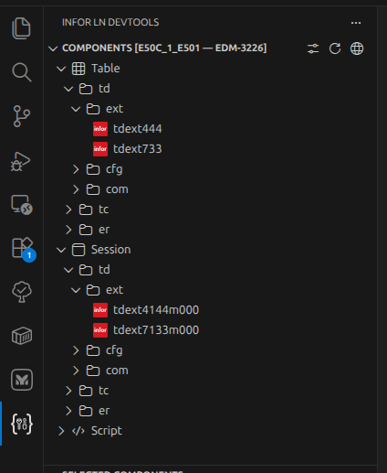
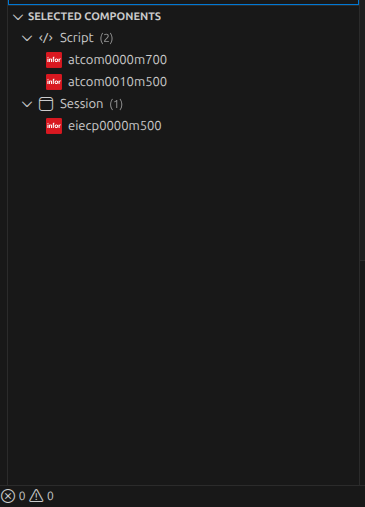
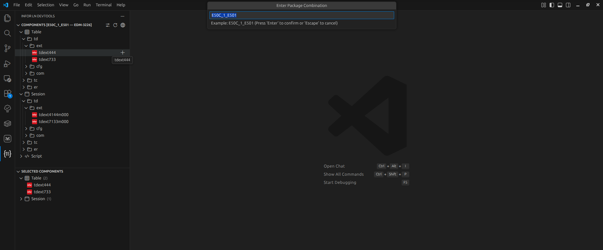

# LN DevTools Extension 
[]()


**LN DevTools** is a Visual Studio Code extension designed to enhance developer workflow for **Infor LN ERP** by allowing developers to browse, select, and import LN components directly into a local development workspace folder.

## 🚀 Key Features

### 📦 Component Exploration
- Components displayed in hierarchical tree:
  ```
  Type → Package → Module → Component Code
  ```
- Supported component types:
  - **Table**
  - **Session**
  - **Script**
- Lazy backend loading:
  - `/modules` loads type → package → module
  - `/components` loads module → codes

### 🎯 Selection Panel
- Dedicated "Selected Components" panel
- Grouping by type
- Supports:
  - Remove individual
  - Remove all
  - Import Selected

### 🧰 Import Workflow
When imported:
1. Selected components sent to backend
2. Backend returns ZIP
3. ZIP extracted to:
   ```
   <Workspace>/Development/<ProjectFolder>/
   ```
4. Tree selection cleared

### ⚙ Persistent Settings
Stored in VS Code global state:
- `serverUrl`
- `vrc`
- `projectFolder`

## 🖥️ Extension UI Overview

### 📦 **Component Explorer**
Shows all LN components grouped by type:



### 📥 **Import Component Flow**
Selection + ZIP generation + import trigger:



### 🧰 **DevTools Panel**
Includes VRC / PMC / Server URL configuration + export/import controls:



# 🧩 Backend API Contract (Updated)

The extension expects the following backend endpoints:

## 1) `GET /modules`

Used to populate the tree hierarchy.

### Response format:
```json
{
  "Table": [
    { "package": "tc", "module": ["ecp", "cmm"] }
  ],
  "Session": [
    { "package": "tc", "module": ["ecp"] }
  ],
  "Script": [
    { "package": "tc", "module": ["ecp"] }
  ]
}
```

## 2) `POST /components`

Triggered when user expands a module node (lazy-load).

### Request:
```json
{
  "type": "<Table|Session|Script>",
  "package": "tc",
  "module": "ecp"
}
```

### Response:
```json
{
  "type": "Table",
  "package": "tc",
  "module": "ecp",
  "code": ["001", "002", "003"]
}
```

## 3) `POST /import`

Triggered on Import operation.

### Request:
```json
{
  "vrc": "E50C_1_E501",
  "importFolder": "EDM-222",
  "components": [
    { "type": "Table", "package": "tc", "module": "ecp", "code": "001" },
    { "type": "Session", "package": "tc", "module": "ecp", "code": "003" }
  ]
}
```

### Response:
Binary ZIP

Headers:
```
Content-Type: application/zip
Content-Disposition: attachment; filename="<importFolder>.zip"
```

ZIP is extracted to:
```
<workspace>/Development/<importFolder>/
```

# 📁 Extracted Folder Structure

Expected after import:

```
Development/
 └── EDM-222/
      ├── TD/
      ├── FD/
      ├── Table/
      ├── Session/
      └── Script/
```

# ⚙ Commands

| Command | Action |
|---|---|
| Refresh | Reload modules from backend |
| Configure Settings | Update VRC + PMC |
| Update Server URL | Change API endpoint |
| Select Component | Add/remove from selection |
| Import Selected | Trigger `/import` |


# 🧪 Mock Backend (Optional)

A simple backend may expose:
- `GET /modules`
- `POST /components`
- `POST /import`

# 📦 Building the Extension

To package:
```
npm run package
```
or
```
vsce package
```

# 🗺 Roadmap Ideas

Future enhancements:
- Export support
- Unloading components
- Diffing tools
- VRC/PMC auto-sync
- SOAP-based real LN integration
- Authentication middleware

# 📄 License
This project is licensed under the MIT License.
